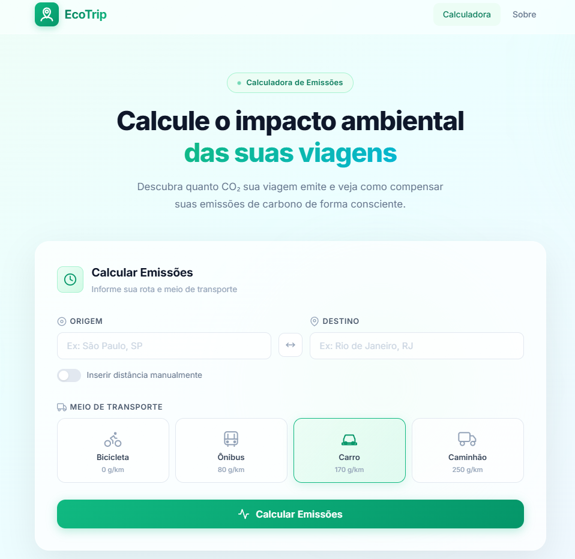
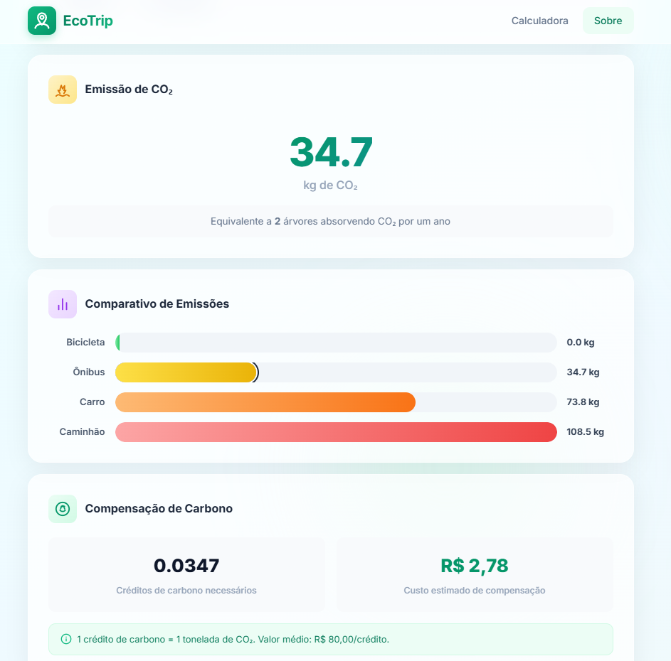
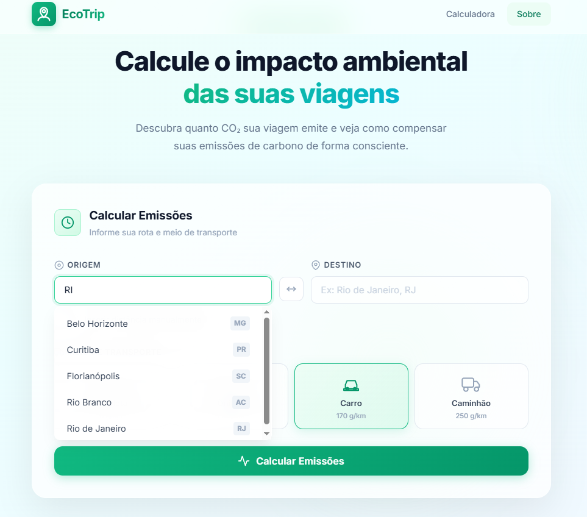

# 🌱 EcoTrip — Calculadora de Emissões de CO₂


> Aplicação web interativa para calcular emissões de CO₂ em viagens entre cidades brasileiras, com comparação entre meios de transporte e estimativa de compensação ambiental.

## 🔗 Deploy

Acesse o projeto online:

👉 https://danieli-dutra.github.io/ecotrip-calculadora-co2/

---

## 📸 Screenshots

### Tela inicial

<p align="center">
  
</p>

### Resultado do cálculo

<p align="center">
  
</p>

### Sugestões de cidades

<p align="center">
  
</p>

---

## 📖 Sobre o projeto

O **EcoTrip** é uma calculadora de emissões de carbono desenvolvida com **HTML, CSS e JavaScript puro**.  
A aplicação permite informar origem e destino, calcular a distância entre cidades brasileiras com base em coordenadas geográficas, selecionar um meio de transporte e visualizar o impacto ambiental estimado da viagem.

O projeto foi pensado com foco em:

- experiência do usuário;
- visual moderno e responsivo;
- interações fluidas;
- consciência ambiental.

---

## ✨ Funcionalidades

- Autocomplete de cidades brasileiras
- Cálculo automático de distância entre origem e destino
- Opção de inserir distância manualmente
- Troca rápida entre origem e destino
- Seleção de meio de transporte
- Cálculo de emissão de CO₂
- Comparação visual entre transportes
- Estimativa de créditos de carbono
- Cálculo de custo para compensação ambiental
- Interface responsiva e com animações suaves

---

## 🧠 Como funciona

A aplicação usa uma base interna com cidades brasileiras e suas coordenadas geográficas.

### Fluxo principal

1. O usuário informa origem e destino.
2. O sistema normaliza os nomes das cidades.
3. A aplicação busca as coordenadas na base local.
4. A distância é calculada com a fórmula de Haversine.
5. O valor é multiplicado pelo fator de emissão do transporte escolhido.
6. O resultado é exibido em kg de CO₂.
7. O sistema também calcula créditos de carbono e custo estimado de compensação.

---

## 🚗 Fatores de emissão utilizados

| Transporte | Emissão |
|------------|---------|
| Bicicleta  | 0 g/km  |
| Ônibus     | 80 g/km |
| Carro      | 170 g/km |
| Caminhão   | 250 g/km |

---

## 🛠️ Tecnologias utilizadas

- HTML5
- CSS3
- JavaScript (ES6+)
- SVG inline
- Google Fonts (Inter)

---

## 📁 Estrutura do projeto

```bash
ecotrip-calculadora-co2/
├── .github/
│   └── workflows/
│       └── deploy.yml
├── assets/
│   ├── screenshot-autocomplete.png
│   ├── screenshot-home.png
│   └── screenshot-results.png
├── css/
│   └── styles.css
├── js/
│   └── scripts.js
├── .gitignore
├── LICENSE
├── index.html
├── package.json
├── README.md
└── requirements.md
```

## ▶️ Como executar o projeto
1. Clone o repositório
git clone https://github.com/seu-usuario/ecotrip.git

2. Acesse a pasta do projeto
cd ecotrip
3. Abra o arquivo index.html

Você pode:

- abrir diretamente no navegador;
- ou usar a extensão Live Server no VS Code.

## ⚙️ Lógica principal

### Cálculo de emissão
Emissão total = distância (km) × fator de emissão (g/km)

### Conversão para kg
kg de CO₂ = gramas de CO₂ ÷ 1000

### Compensação de carbono
1 crédito de carbono = 1 tonelada de CO₂
Valor médio por crédito = R$ 80,00

## 🎨 Diferenciais de interface

O projeto foi desenvolvido com um visual moderno, incluindo:

- cards com efeito glassmorphism;
- destaque visual para estados de seleção;
- animações leves e suaves;
- layout adaptável para dispositivos menores;
- feedback visual para carregamento, erro e resultado.

## 🚀 Possíveis melhorias

- integração com API real de rotas;
- uso de mapas interativos;
- salvamento de histórico no navegador;
- exportação dos resultados;
- gráficos de comparação mais avançados;
- modo escuro.

## 👩‍💻 Autoria

Desenvolvido por Danieli Dutra
Projeto final de bootcamp **CI&T em parceria com a DIO** com foco em **desenvolvimento front-end, UX/UI e solução com impacto ambiental**.

## 📄 Licença

Este projeto está sob a licença MIT.
